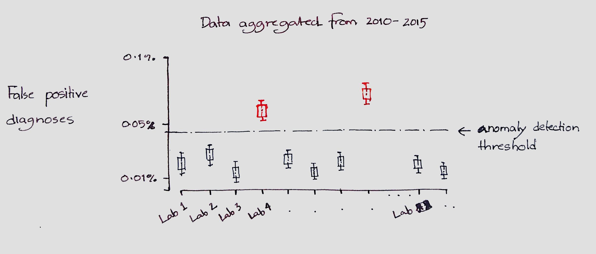
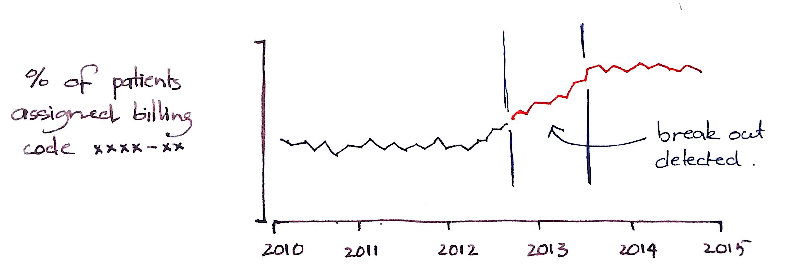
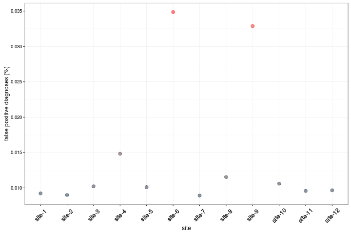
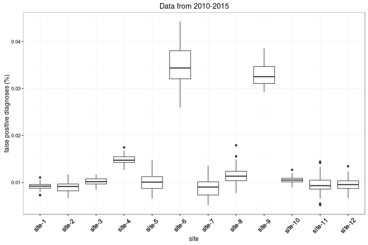

## DQA visualization 

This repository contains ideas for data quality visualizations generated for the DQA-viz project

### Preliminary sketches (for Apr 4 meeting)

For this week, I generated some preliminary sketches for assessing data quality using the **plausibility** dimension of the harmonized DQA framework. I was inspired by the [breakout detection](https://blog.twitter.com/2014/breakout-detection-in-the-wild) and [anomaly detection](https://blog.twitter.com/2015/introducing-practical-and-robust-anomaly-detection-in-a-time-series) tools from twitter.

#### Sketch-1: Anomaly detection across multiple sites

#### Sketch-2: Temporal anomaly detection

### Test with simulated data

#### Visualization-1: Summary for lay audience

#### Visualization-2: Summary for technical audience

#### Visualization-3: All data

