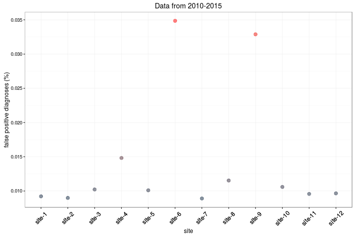
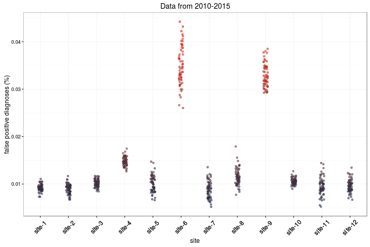

## DQA visualization 

This repository contains ideas for data quality visualizations generated for the DQA-viz project

### Preliminary sketches 

I started with some preliminary sketches for assessing data quality using the **plausibility** dimension of the harmonized DQA framework. I was inspired by the [breakout detection](https://blog.twitter.com/2014/breakout-detection-in-the-wild) and [anomaly detection](https://blog.twitter.com/2015/introducing-practical-and-robust-anomaly-detection-in-a-time-series) tools from twitter.

#### Sketch-1: Anomaly detection across multiple sites

#### Sketch-2: Temporal anomaly detection

### Test with simulated data

The [simulated data](data/anomaly-by-site.csv) consists of percentage of false positive diagnoses from 12 sites over 60 observation periods (we pretend that these are monthly records over a 5 year period). Two of the sites have anomalously high false dignoses rates. Ideally, we want a DQA tool to visually flag such sites. The four visualizations below demonstrate how this could be accomplished at different levels of visual complexity.

#### Visualization-1: Summary for lay audience

Variation: bar chart

#### Visualization-2: Summary for technical audience

#### Visualization-3: All data

