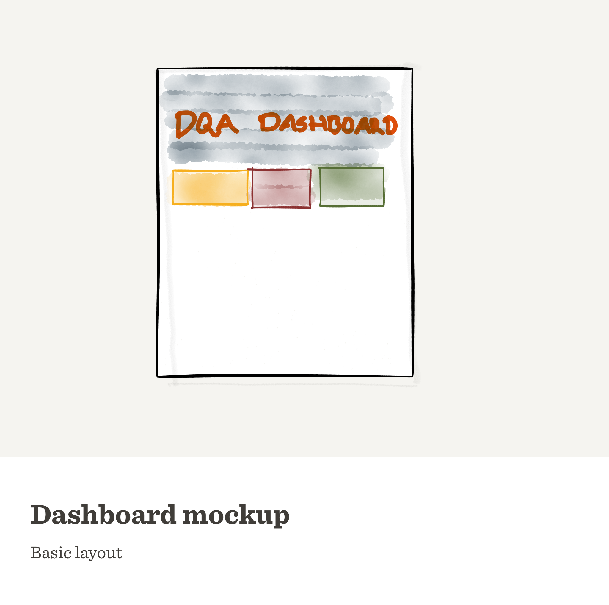
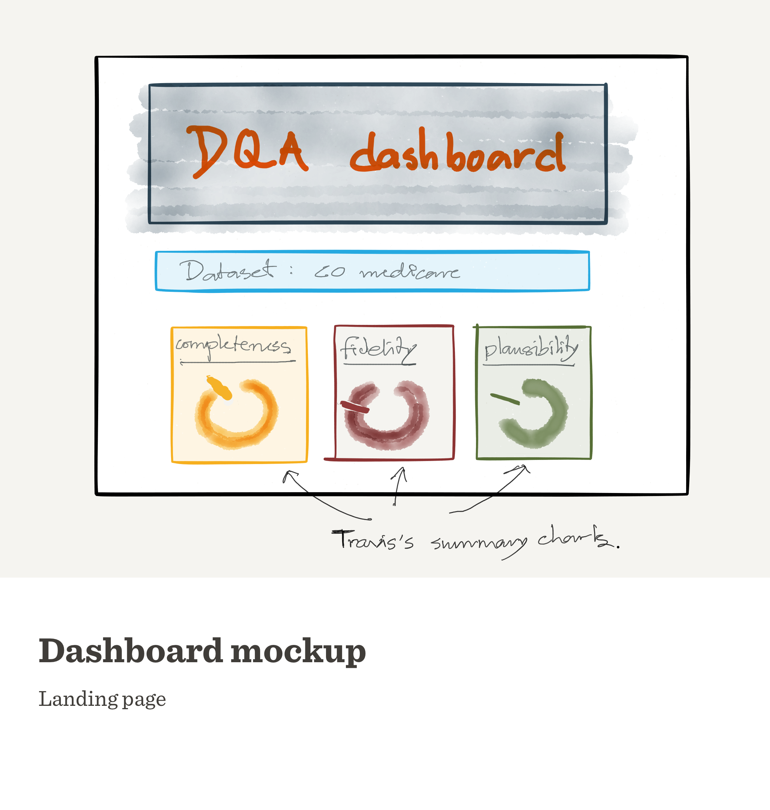
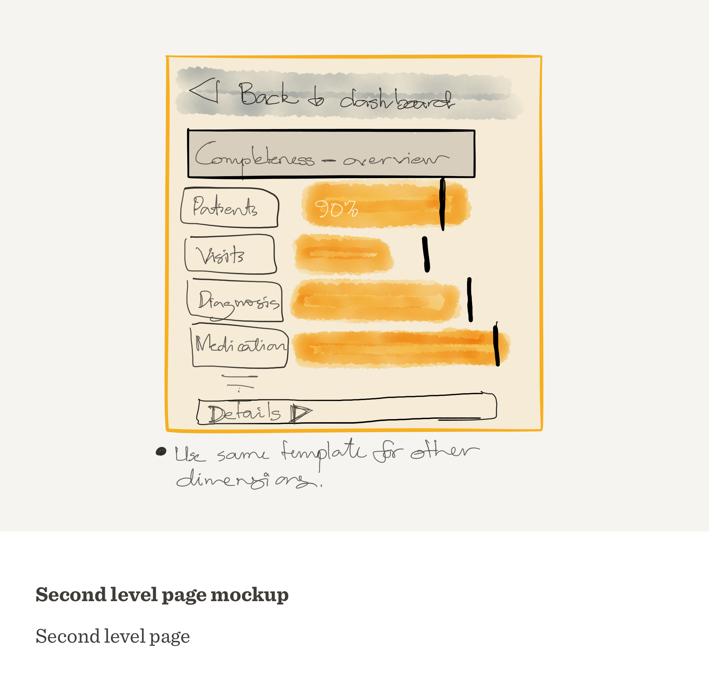
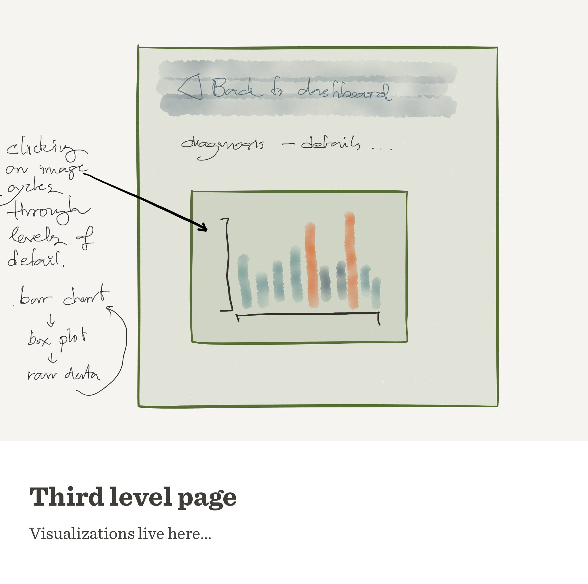

[Back to the front page](README.md)

## Preparing for face-to-face meetings

At the moment, we have a collection of visualizations - based on real and simulated data - and some dashboard prototypes. But we have not settled on how all these pieces should be "assembled" together for the f2f meetings. Rather than spending our limited time on creating an something that's elaborate, I want to suggest setting up a minimalistic website to guide the meeting  presentations. My vision is a site containing minimal text, and a series of clickable images that transition through the different visualizations under each category.

What are the pros and cons of this approach?

**Pros**:

- A simple web site requires only basic html and css (perhaps with some javascript for transitions.)
- We are not tied to any commercial software, eg: antetype or marvel.
- We can easily insert/remove/rearrange content, possibly on the fly, based on feedback received at the meeting.
- We can let meeting participants explore the website on their own devices, rather than us guiding them along

**Cons**:

- Setting up and modifying the website with require familiarity with html/css/javascript.
- It will be challenging to create anything too elaborate.

### Mock ups

What would such a website look like? These mockups show some of my initial ideas:

The initial conception:

A more detailed landing page:

Clicking any of the charts loads the second level page with more details:

And finally, we can use a third level page to display all the visualizations

### More ideas

Some more thoughts on how to utilize this website:
- A short description "card" to go with each visualization.
- Link to external interactive visualizations, eg: Sigfried's parallel coordinates.

[Back to the front page](README.md)

